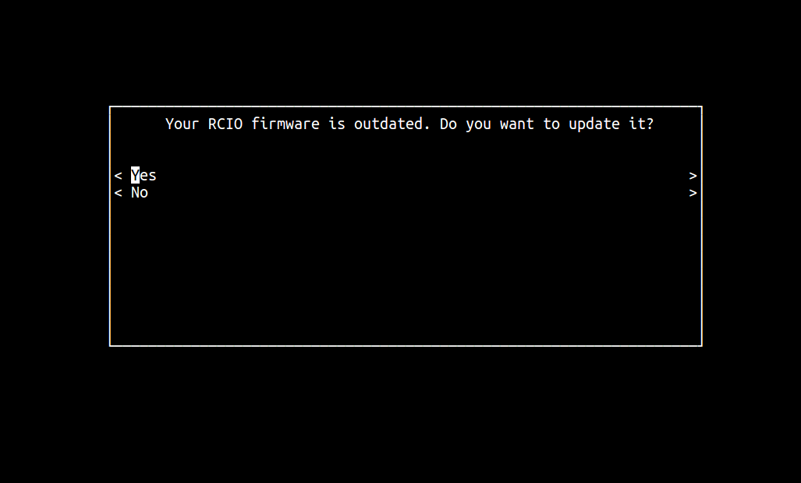
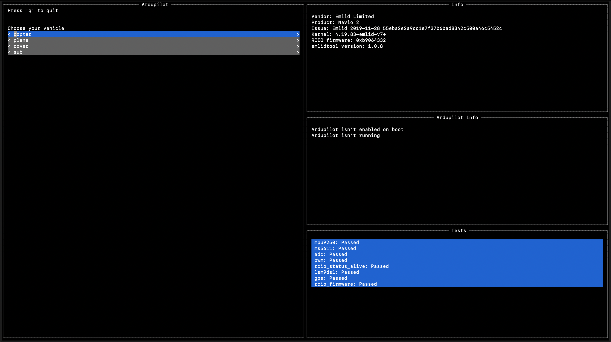
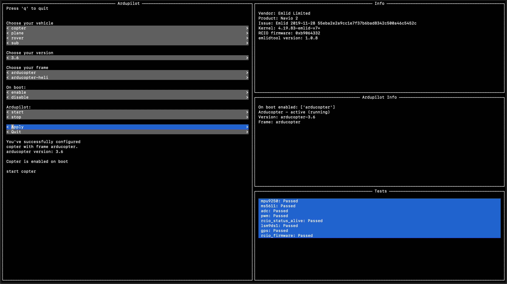

## Overview

You can run ArduPilot on Raspberry Pi 3 or 2 with Navio. The autopilot's code works directly on Raspberry Pi. For ArduPilot to work properly please use the configured Raspbian distribution that we provide.  

## Current vehicle versions

Emlid Raspbian has preinstalled ArduPilot. It includes all vehicles and is based on the most stable branch available. Currently these are:

* ArduPlane: **3.8.5**
* ArduRover: **3.3.0**
* ArduCopter: **3.5.5**

## Greeting

Once you ssh into Raspberry Pi you'll be greated with a message that looks like this:

```
                                                                
                #     #    #    #     # ### ####### 
                ##    #   # #   #     #  #  #     # 
                # #   #  #   #  #     #  #  #     # 
                #  #  # #     # #     #  #  #     # 
                #   # # #######  #   #   #  #     # 
                #    ## #     #   # #    #  #     # 
                #     # #     #    #    ### ####### 
                                                                
STEP 1: 
Choose your vehicle and ArduPilot version using emlidtool
(Please, read carefully all options and select appropriate one for either Navio 2 or Navio+)
- sudo emlidtool ardupilot

STEP 2:
Set your GCS IP 
        - sudo nano /etc/default/arducopter
        - sudo nano /etc/default/arduplane
        - sudo nano /etc/default/ardurover
STEP 3:
Reload configuration by issuing these commands
        - sudo systemctl daemon-reload

Launch, and enable on boot

- sudo emlidtool ardupilot

IMPORTANT:

To show this message one more time type "sudo emlidtool ardupilot help"

* Documentation: https://docs.emlid.com/
```

We'll guide you through what's going on under the hood in the sections below.

## Systemd

For launching ArduPilot we are using `systemd` init system which provides manager for all services and processes. 
The main command used to control systemd is `systemctl`. Some of its uses are:

* examining the system state 
* managing the system and services. 

See `man systemctl` for more details.

## Choosing a vehicle, version and board

To select the vehicle that would be launched by default you should configure it with emlidtool:
```bash
sudo emlidtool ardupilot
```

Before configuration emlidtool checks your [RCIO](https://docs.emlid.com/navio2/dev/rcio) firmware and will suggest to update it if you have the outdated one:

!!! tip
    Only for Navio2



In the example below we'll use arducopter but it could've been just as well arduplane or ardurover.
Once the command is running, it will produce the output like this:



At this point you should enter the right choices in the left menu corresponding to your vehicle and frame.
Also, you need to decide whether you want to get ardupilot enabled on boot or not and start/stop it now.
  
Let's assume that we have arducopter, and we've decided to enable it on boot and start.

After clicking the 'Apply' button ArduPilot will be configured and you'll see the changes in the ArdupilotInfo widget:



## Specifying launching options
 
Open the file:

```bash
pi@navio: ~ $ sudo nano /etc/default/arducopter 
```

Here you can specify IP of your ground station.

```bash
TELEM1="-A udp:127.0.0.1:14550"
#TELEM2="-C /dev/ttyAMA0"

# Options to pass to ArduPilot
ARDUPILOT_OPTS="$TELEM1 $TELEM2"

# -A is a console switch (usually this is a Wi-Fi link)

# -C is a telemetry switch
# Usually this is either /dev/ttyAMA0 - UART connector on your Navio
# or /dev/ttyUSB0 if you're using a serial to USB convertor

# -B or -E is used to specify non default GPS
```

All lines marked '#' are comments and have no effect. 

For example, you'll need to modify TELEM1 to point to your IP like this:

`TELEM1`="-A udp:192.168.1.2:14550"

Where 192.168.1.2 is the IP address of the device with the Ground Control Station - your laptop, smartphone etc.

!!! tip
    You can add additional options to `ARDUPILOT_OPTS` that are then passed to ArduPilot by adding new `TELEM` environment variables like this: `TELEM3`="-E /dev/ttyUSB1" `ARDUPILOT_OPTS`="$TELEM1 $TELEM2 $TELEM3"

Mapping between switches and serial ports (TCP or UDP can be used instead of serial ports):

* -A - serial 0 (always console; default baud rate 115200)  
* -C - serial 1 (normally telemetry 1; default baud rate 57600)  
<sub>3DR Radios are configured for 57600 by default, so the simplest way to connect over them is to run with -C option.</sub>
* -D - serial 2 (normally telemetry 2; default baud rate 57600)  
* -B - serial 3 (normally 1st GPS; default baud rate 38400)  
* -E - serial 4 (normally 2st GPS; default baud rate 38400)  
* -F - serial 5  

Additionally take a look at [list of serial parameters](http://ardupilot.org/copter/docs/parameters.html?highlight=serial#serial-parameters) for Mission Planner.

When using UART for telemetry please keep in mind that serial ports have default baud rates.   


## Reload configuration

If you changed something in the previous step you need to reload configuration for systemd to work properly.

```bash
pi@navio: ~ $ sudo systemctl daemon-reload
```

## Starting

Now you can start ArduPilot:

```bash
pi@navio: ~ $ sudo systemctl start arducopter
```

To stop the service run:

```bash
pi@navio: ~ $ sudo systemctl stop arducopter
```

## Autostarting on boot

To automatically start ArduPilot on boot you need to enable `arducopter`:

```bash
pi@navio: ~ $ sudo systemctl enable arducopter
```

To disable the autostart:
```bash
pi@navio: ~ $ sudo systemctl disable arducopter
```

You can check is ArduPilot already enabled or not:
```bash
pi@navio: ~ $ systemctl is-enabled arducopter
```


## Connecting to the GCS

### Mission Planner

A Windows only ground station. It is the most feature complete, though.
It can be downloaded from the [ardupilot.com](http://firmware.ardupilot.org/Tools/MissionPlanner/)

### QGroundControl

A crossplatform ground station for Mavlink-based flight stacks (like Ardupilot).
It can be downloaded from the [qgroundcontrol.com](https://docs.qgroundcontrol.com/en/getting_started/download_and_install.html)

### APM Planner

APM Planner is a ground station software for ArduPilot. It can be downloaded from the
[ardupilot.com](http://firmware.ardupilot.org/Tools/APMPlanner/)

APM Planner listens on UDP port 14550, so it should catch telemetry from the drone automatically.
Also, if you are using linux, you have to add your user to dialout group '''sudo adduser $USER dialout'''
### MAVProxy

MAVProxy is a console-oriented ground station software written in Python. It’s well suited for advanced users and developers.

To install MAVProxy use [Download and Installation](http://ardupilot.github.io/MAVProxy/html/getting_started/download_and_installation.html) instructions.


To run it specify the --master port, which can be serial, TCP or UDP. It also can perform data passthrough using --out option.

```bash
pi@navio: ~ $ mavproxy.py --master 192.168.1.2:14550 --console
```

Where 192.168.1.2 is the IP address of the GCS, not RPi.

## Launching a custom ArduPilot binary

Navio is supported in ArduPilot upstream and if you'd like to build the binary yourself please proceed to the [Building from sources](building-from-sources.md). Also you can download the latest stable binary files from ArduPilot buildserver. To download arducopter binary:

```bash
pi@navio: ~ $ wget http://firmware.eu.ardupilot.org/Copter/stable/navio2/arducopter
pi@navio: ~ $ chmod +x arducopter
```
In case of use helicopter, change tail of the link. For example `/navio2-heli/arducopter-heli`. Supported vehicle types are listed below:

* ArduRover
* ArduPlane
* ArduCopter
* ArduCopter-heli

If you want to launch a custom binary you're expected to modify and use /etc/systemd/system/ardupilot.service

```bash

[Unit]
Description=ArduPilot for Linux
After=systemd-modules-load.service
Documentation=https://docs.emlid.com/navio2/navio-ardupilot/installation-and-running/#autostarting-ardupilot-on-boot
Conflicts=arduplane.service arducopter.service ardurover.service

[Service]
EnvironmentFile=/etc/default/ardupilot

###############################################################################
####### DO NOT EDIT ABOVE THIS LINE UNLESS YOU KNOW WHAT YOU"RE DOING #########
###############################################################################

# Uncomment and modify this line if you want to launch your own binary
#ExecStart=/bin/sh -c "/home/pi/<path>/<to>/<your>/<binary> ${ARDUPILOT_OPTS}"

##### CAUTION ######
# There should be only one uncommented ExecStart in this file

###############################################################################
######## DO NOT EDIT BELOW THIS LINE UNLESS YOU KNOW WHAT YOU"RE DOING ########
###############################################################################

Restart=on-failure

[Install]
WantedBy=multi-user.target
```

The comments speak for themselves. The only thing you need to adjust is 
```bash
#ExecStart=/bin/sh -c "/home/pi/<path>/<to>/<your>/<binary> ${ARDUPILOT_OPTS}"
```
to something like this
```bash
ExecStart=/bin/sh -c "/home/pi/arducopter-quad ${ARDUPILOT_OPTS}"
```
Other than that the launching procedure is no different than the one described above with the only exception that you need to use systemctl utility with `ardupilot` service instead of `arducopter`/`arduplane`/`ardurover` and use `/etc/default/ardupilot` for `ARDUPILOT_OPTS` modifications.

The command below  will start custom ArduPilot binary and then mark it to launch on boot:

```bash
pi@navio: ~ sudo systemctl start ardupilot && sudo systemctl enable ardupilot
```
