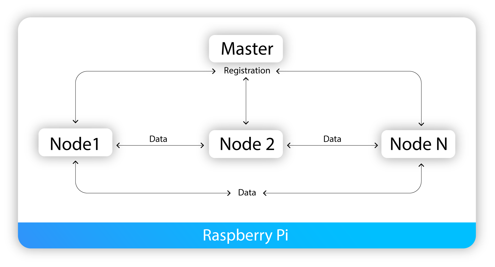
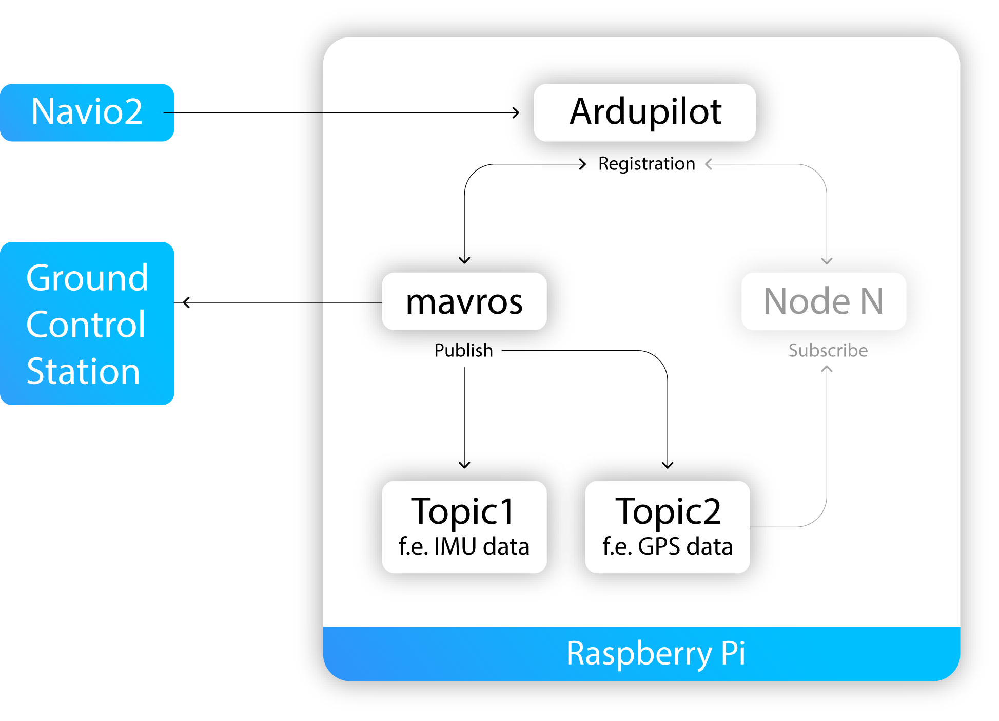
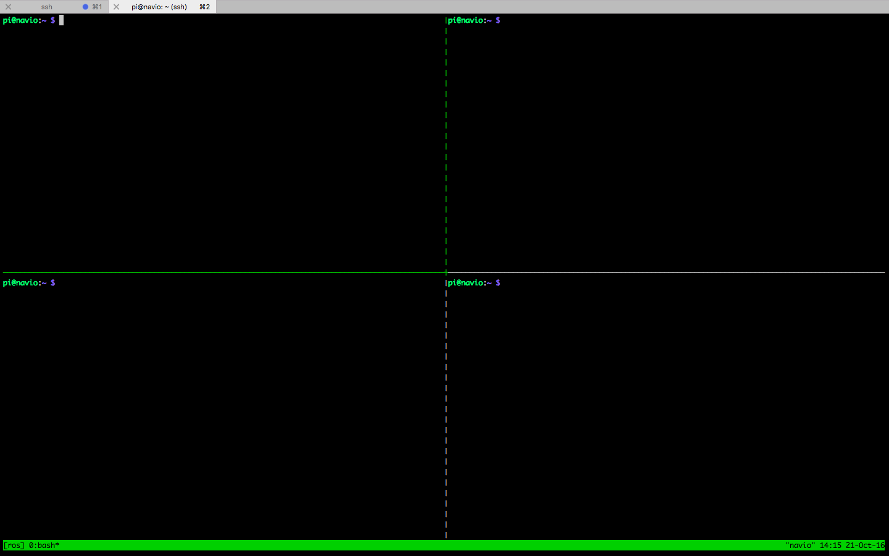
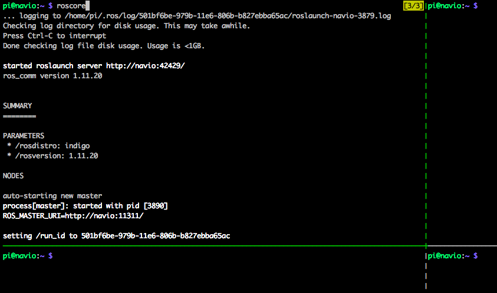
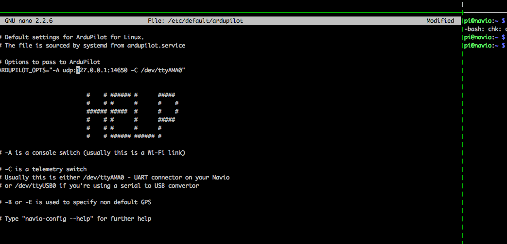
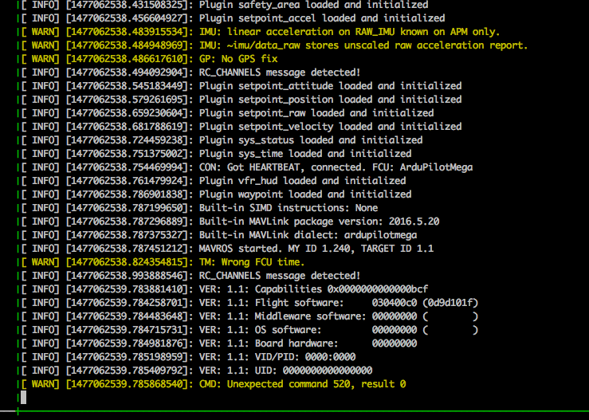
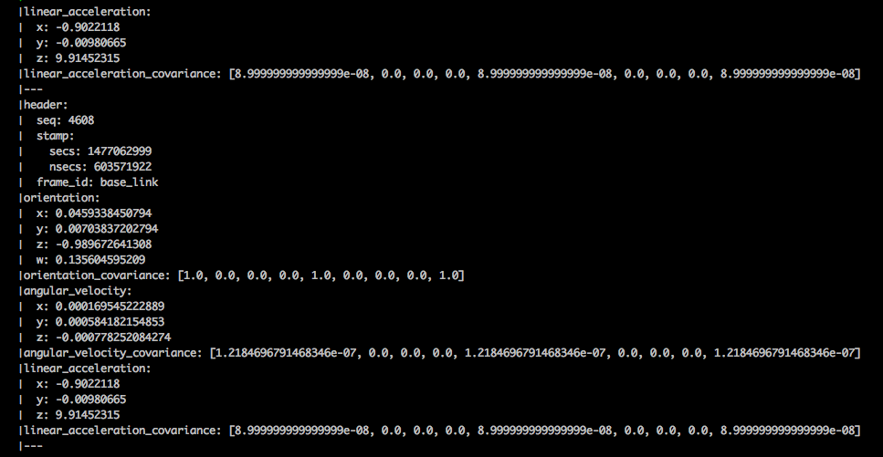

## ROS

Emlid Raspbian image comes with pre-installed ROS.

## Basic understanding

### What is ROS?

Robot Operating System is an endeavor of thousands of roboticists around the globe to make development of new robots easier. ROS is an open source project which includes a ton of useful tools and that makes developing process more efficient. The idea is that you don't have to redesign the wheel every time. Someone else has already done that, and they've probably done it better than you, so you can focus your energy on specific part you want to build.

### Overview

Here we will look at general scheme of ROS incorporated in Emlid Raspbian. Firstly we will give a general concept of ROS and then do everything step by step to get started promptly with some basic understanding.

Emlid image includes pre-installed ROS, so all we have to do is to start it after a little setup (we will cover this step [below](#ros-setup)). After [running ROS](#running-roscore) we will find ourselves at ROS Master, the place containing all services, kind of a meeting point for *nodes*.
From this place we now are able to find *nodes* and make them communicate to each other on your Raspberry Pi. For this moment we can imagine a node, for instance, as an IMU-sensor which gives us some data. There might be different set of drivers within one node.




Now we are going just a little bit deeper. Nodes can find each other and share data. This data shared between nodes is called "Messages". Nodes can [publish messages](#running-rostopic) to the topics  and may subscribe to topics to receive messages.

Let's take into consideration that we usually run ROS alongside ardupilot. For your convenience Emlid image contains [mavros node](#running-mavros-node) pre-installed. This node provides a lot of sensor drivers, communication driver for [ardupilot](#running-ardupilot) and proxy to [GCS](#running-a-gcs).



To make things clear let's proceed to step-by-step ROS running practical instructions which will help to perceive acquired knowledge.


## How to get your hands on: step by step

Start watching the tutorial on <a href="https://asciinema.org/a/1i915k6h2b0i9sf02mwom7qu8?t=0" target="_blank">asciinema.org</a>.

### Introduction to tmux
You'll need to ```ssh``` into your Raspberry Pi from several terminals simulteneously. That's why we recommend using a *terminal multiplexer* like [tmux](https://tmux.github.io/).
For operating tmux while working with ROS you have to learn some basics. 

Before splitting the screen we have to create a new session  ``` $ tmux new -s session-name ```

The following commands might be useful too:

To attach to an existing session   ```  $ tmux a -t session-name ```

To detach from session   ``` $ tmux detach ```

To kill session   ``` $ tmux kill-session -t session-name ```

Inside sessions we have to operate and navigate somehow with a number of functions. For this *tmux* has a *universal shortcuts* that lets you quickly perform many tasks.

Useful shortcuts:

``` Ctrl+b ``` + ``` ? ```  to show hot keys

``` Ctrl+b ``` + ``` $ ```  to rename current session

``` Ctrl+b ``` + ``` % ```  to split horizontally

``` Ctrl+b ``` + ``` " ```  to split vertically

``` Ctrl+b ``` + ``` o ```  to toggle between panes

``` Ctrl+b ``` + ``` x ```  to kill the current pane

For further information please refer to this [tutorial](https://danielmiessler.com/study/tmux/#basics).


## Preparing terminal
Create a tmux session called "ros"

```bash
pi@navio: ~ $ tmux new -s ros
```
And split your window into 4 panes like this:



We recommend you to take your time and practice to navigate between panes in an efficient manner using hot keys.

Continue <a href="https://asciinema.org/a/1i915k6h2b0i9sf02mwom7qu8?t=22" target="_blank">watching the tutorial</a> for this step.


### Running roscore

Now it's time to start ROS Master. Select top-left (doesn't matter which one actually) pane and run ```roscore```

```
pi@navio: ~ $ roscore
```
If you are successful bash will show you the following and you'll see Master started on Raspberry Pi.



Continue <a href="https://asciinema.org/a/1i915k6h2b0i9sf02mwom7qu8?t=59" target="_blank">watching the tutorial</a> for this step.

```roscore``` is a backbone of ROS. It's the first thing you should run when using ROS because it's vital for successful node execution and making publisher-subscriber architecture work.

### Running ardupilot

Let's run ArduPilot in another pane as stated in [here](../../ardupilot/installation-and-running/#launching-a-custom-ardupilot-binary) pointing telemetry to **127.0.0.1:14650**
by modifying ```/etc/default/ardu{copter, plane, rover}``` depending on which vehicle do you use. Let's say that we have copter. Then we need to enter:

```no-highlight
sudo nano /etc/default/arducopter
```



Then type:

```
pi@navio: ~ $ sudo systemctl start arducopter
```

This command launches ArduPilot (one-shot ```sudo systemctl enable arducopter``` to make it persistent). You'll see your LED blinking.

In case you make changes in ArduPilot while it's working, you should then restart:

```
pi@navio: ~ $ sudo systemctl restart arducopter
```

Continue <a href="https://asciinema.org/a/1i915k6h2b0i9sf02mwom7qu8?t=1:14" target="_blank">watching the tutorial</a> for this step.
### Running a GCS

[Launch](../../ardupilot/installation-and-running/#connecting-to-the-gcs) your GCS (Ground Control Station) of choice. On the next step you'll understand why.

### Running mavros node

As we've already discussed within the ROS package we are working with an executable files called nodes. Each ROS node contains specific functions and uses a ROS client library to communicate with other nodes. For example, we will run [mavros](http://wiki.ros.org/mavros) which makes it easy to access sensor data from ArduPilot. Moreover according to the scheme from the overview, mavros will become a udp bridge to Ground Control Station we've launched on previous step.

Run this command in a third pane:

```
pi@navio: ~ $ rosrun mavros mavros_node \
_fcu_url:=udp://:14650@ \
_gcs_url:=udp://:14551@192.168.1.189:14550
```
Make sure that:
- **14650**  is the same port we specified in ```/etc/default/ardupilot```
- **192.168.1.189:14550** is IP and port of the computer where GCS is launched.

If you feel enthusiastic you can create a custom [.launch](http://wiki.ros.org/mavros#Usage) file or edit pre-installed to launch everything quicker.
Roslaunch will automatically start a roscore if there isn’t already one running.
Example launch files are available in the `/opt/ros/noetic/share/mavros/launch` directory.

You need to modify ```fcu_url``` and ```gcs_url``` in ```/opt/ros/noetic/share/mavros/launch/apm.launch``` and run:

```
roslaunch mavros apm.launch
```

To run this on boot you can create a simple systemd service. Create mavros.service file in `/lib/systemd/system` with the following contents:
```
[Unit]
Description=mavros 

[Service]
Type=simple
ExecStart=/bin/bash -c "source /opt/ros/noetic/setup.bash; /usr/bin/python /opt/ros/noetic/bin/roslaunch mavros apm.launch"
Restart=on-failure

[Install]
WantedBy=multi-user.target
```

Then run:
```
sudo systemctl daemon-reload
```

And enable it on boot:
```
sudo systemctl enable mavros.service
```


Finally after everything's set you'll see something like this:



Continue <a href="https://asciinema.org/a/1i915k6h2b0i9sf02mwom7qu8?t=2:52" target="_blank">watching the tutorial</a> for this step.

### Running rostopic

``rostopic`` tools allows you to get information about ROS topics.

To learn sub-commands for ``rostopic`` you can use help option:
```
$ rostopic -h
```
If you don't use GCS, but want to get data from rostopic then you need to enter the following command for setting the stream rate:
```
pi@navio: ~ $ rosservice call /mavros/set_stream_rate 0 10 1
```

For mavros we will run *echo* command in the last pane to show the data published on topic.

```
pi@navio: ~ $ rostopic echo /mavros/imu/data
```




After typing `rostopic echo /mavros/` you can press TAB to see the list of existing topics and check them to practice more.

Continue <a href="https://asciinema.org/a/1i915k6h2b0i9sf02mwom7qu8?t=4:01" target="_blank">watching the tutorial</a> for this step.

!!! tip ""
    You always can look more thoroughly on [ROS wiki](http://wiki.ros.org/) to get a better understanding of its concepts.
