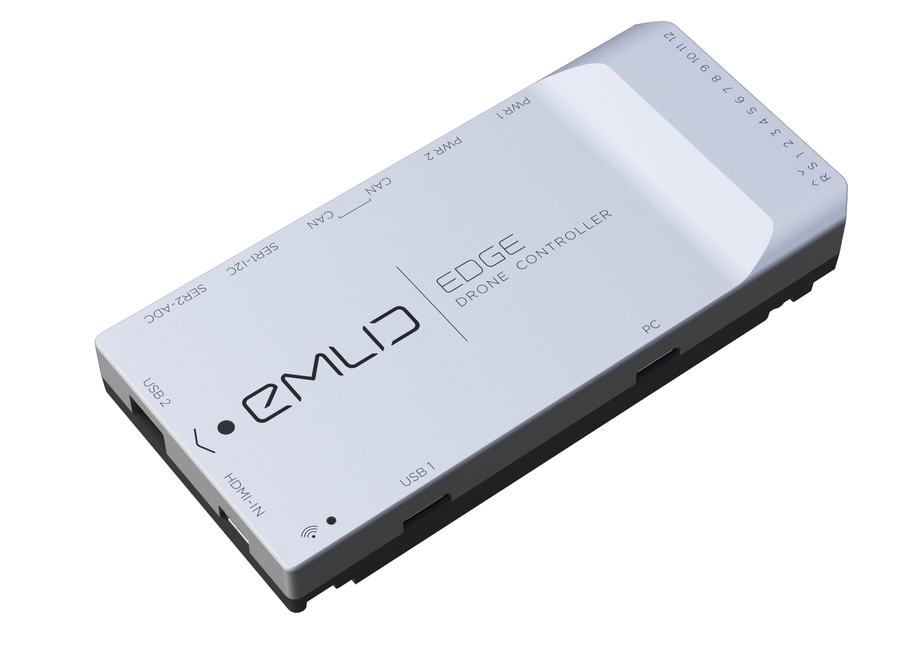

 

### Welcome to your Emlid Edge!

This drone controller was created as a flexible solution that can cover both flight control and video streaming in a single package.
Emlid team is striving to always keep improving the product and you will be regularly getting updates bringing more features and refining the user experience.
We hope that you’ll like Edge and it will become your number one choice for drone controller.

### Package contents

In the box:

* 1 x Emlid Edge drone controller

* 1 x GNSS module

* 1 x Power module

* 1 x Pack of wires

* 2 x Packs of mounting foam

* 1 x User guide

### Getting started

First step to begin working with Edge is to [install QGroundControl for Edge](gcs-installation.md)

### Collaboration

This document can be edited on [GitHub](https://github.com/emlid/edge-docs) in Markdown. If you find any mistakes, typos or  pieces that are not documented well enough simply open an issue or contribute by sending a pull request.

