###Currently supported boards

APM autopilot port for Navio+ is developed and tested on **Raspberry Pi 2 Model B**.

Previous models such as Raspberry Pi Model A+ and Raspberry Pi Model B+ are electrically compatible, but lack performance to run APM:Copter on 400Hz. These models are sufficient to run developer examples and APM:Rover.

Raspberry Pi Zero is electrically compatible, but has not been tested yet.

It is completely safe to use Navio+ with all boards stated above.

###Attaching Navio+ to a Raspberry Pi

* Install spacers to the top side of Raspberry Pi and fix them with screws from the bottom.
* Connect extension header to the 40-pin gpio port.
* Attach Navio+ to the extension header.
* Fix Navio+ using screws.

###Powering Navio+

Navio+ has three power sources, all of them can be used simultaneously as they are protected by ideal diodes.

**IMPORTANT: ALL POWER SOURCES SHOULD PROVIDE VOLTAGE IN 4.8-5.3V RANGE, OTHERWISE YOU CAN DAMAGE YOUR NAVIO+ AND RASPBERRY PI.**

***For testing and development purposes:***

Connect 5V 1A power adapter to the Raspberry Pi’s microUSB port. Raspberry Pi will provide power to the Navio+.

***In a drone:***

Navio+ should be powered by a power module connected to the “POWER” port on Navio+. Navio+ will provide power to the Raspberry Pi.
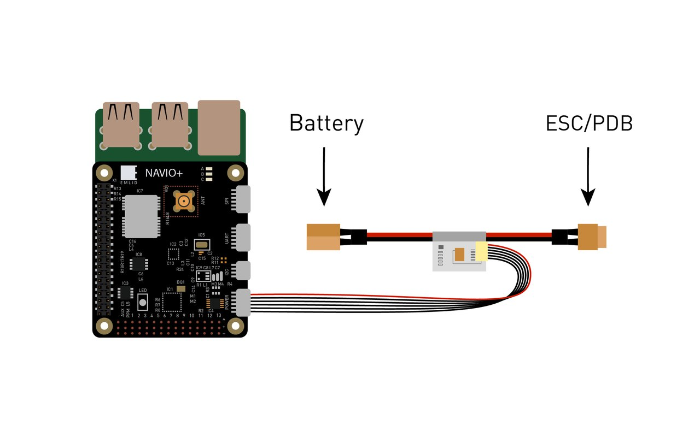

***Redundancy:***

In case of power module failure Navio+ will switch to power from the servo rail.

###Powering servo rail

Power module does not power servos. To provide power to the servo rail plug your drone’s BEC into any free channel on the servo rail. Use BECs that provide voltage in a range of 4.8-5.3V. If you’d like to use high voltage servos, use a power separation board.

###GNSS antenna
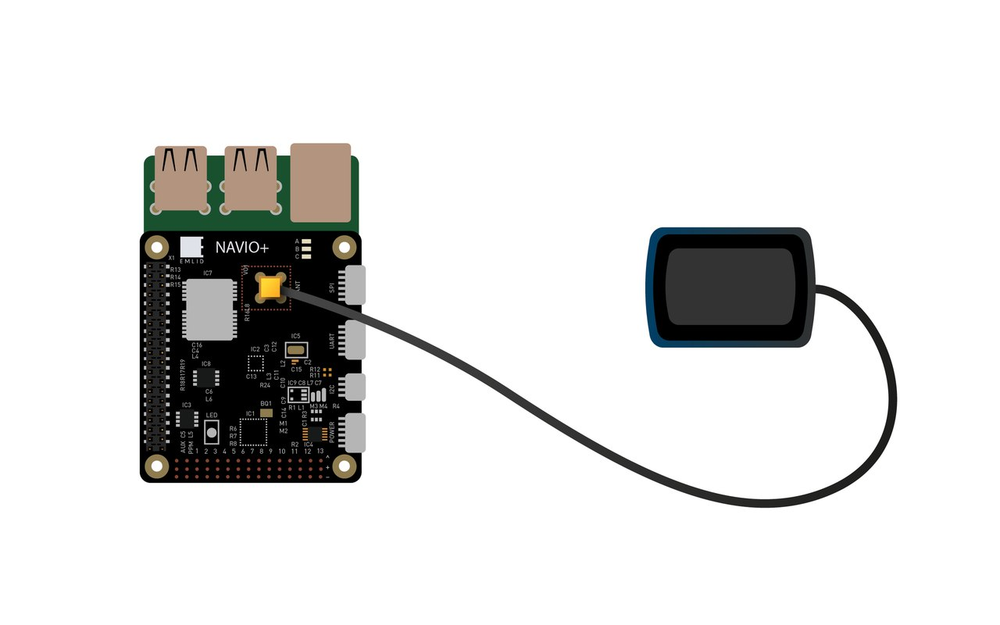

###RC input
Navio+ only supports PPM signal as an input. To connect receivers that do not support PPM output you can use PPM decoder or SBUS to PPM converter. PPM receiver is powered from a servo rail, so BEC should be present.

Receivers with PPM output:

**For ACCST (most FrSky transmitters):**

* FrSky D4R-II 4ch 2.4Ghz ACCST Receiver
* FrSKY V8R7-SP ACCST 7 Channel RX with composite PPM
* FrSKY D8R-XP

**For FASST (Futaba & some FrSky transmitters):**

FrSky TFR4 4ch 2.4Ghz Surface/Air Receiver FASST Compatible

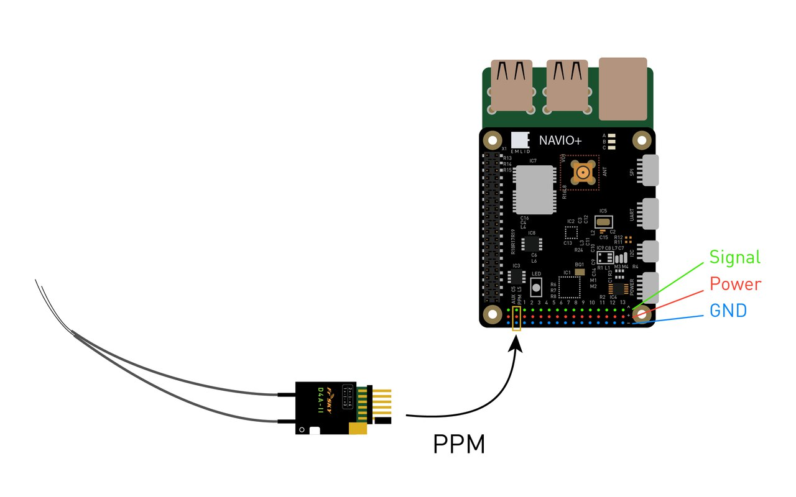
###RC output

Power module does not provide power to servos so a BEC should be present. BEC would serve as back-up power supply to Navio+.

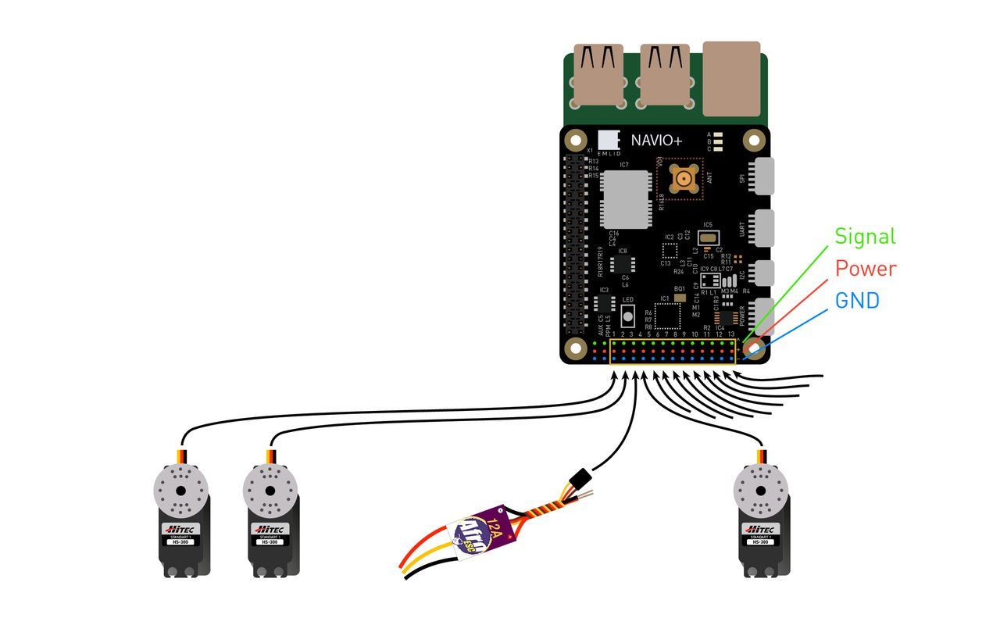

Only one ESC central wire should be connected to Navio+ otherwise BECs built in ESCs will heat each other.

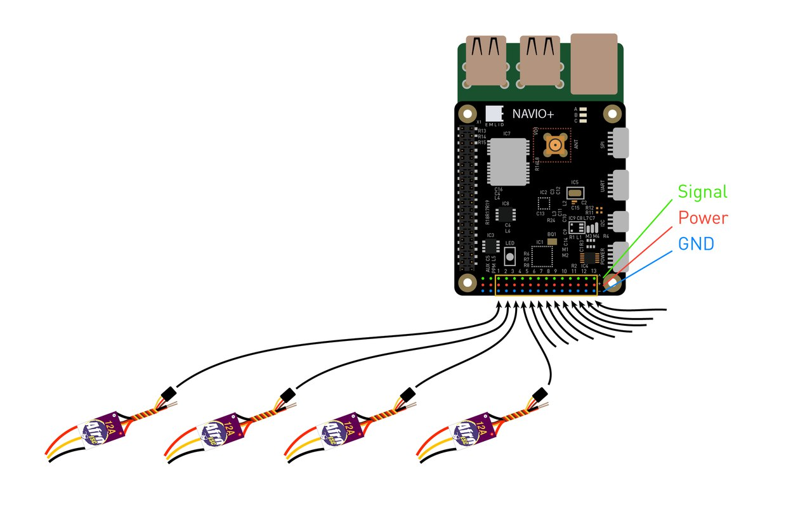

###Telemetry modem

Radio modems can be connected either over UART or over USB.

For UART port use /dev/ttyAMA0 serial.
Please do not connect CTS line when using 3DR Radio as RPi does not handle hardware flow control properly.
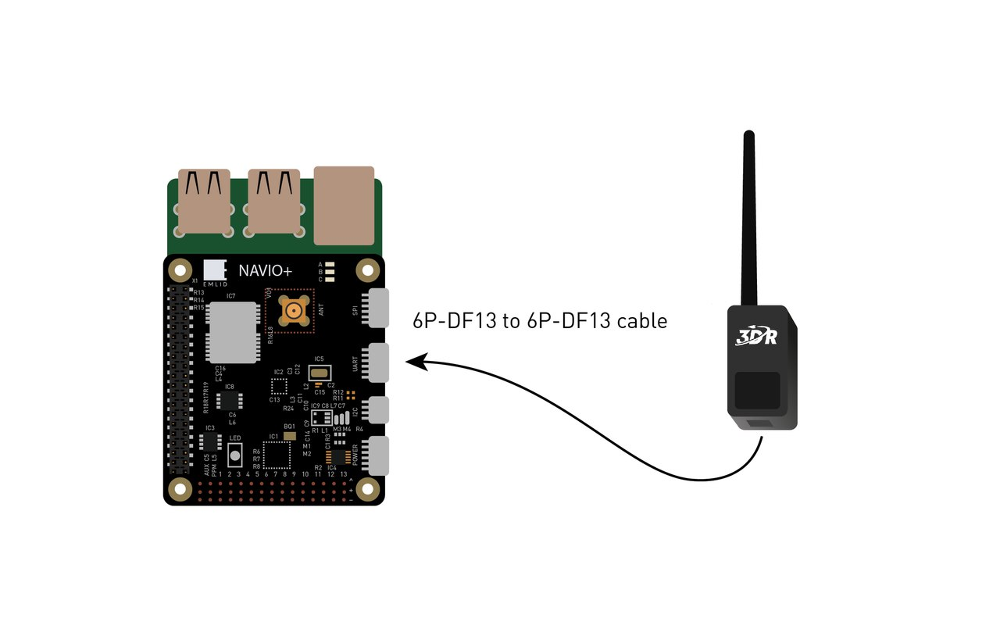

Use /dev/ttyUSB0 virtual serial port for USB.
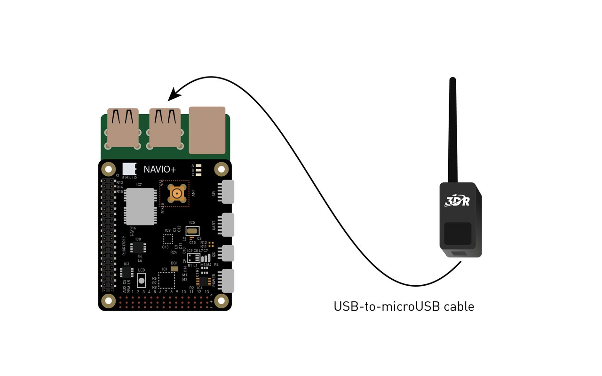

###Barometer UV protection

MS5611 barometer (steel cap IC) is sensitive to UV light and might report sudden jumps in altitude under sunlight. It is very important to cover it with a piece of cloth (something like microphone fabric) or put autopilot in a protective case to protect it both from sunlight and airstreams.

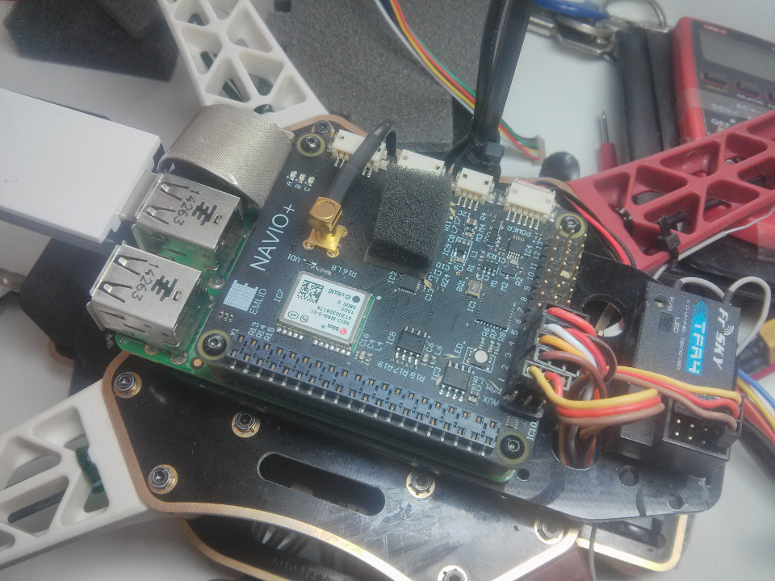

###3D cases

A couple of 3D printable cases are available for Navio+\RPi2 made by Navio+ users:

[NAVIO+ RPi2 Case by Pedro Alves](http://www.thingiverse.com/thing:872991)

Can be ordered on the [Airborne Projects website](https://www.airborneprojects.com/product/navio-rpi2-3d-printed-case/).

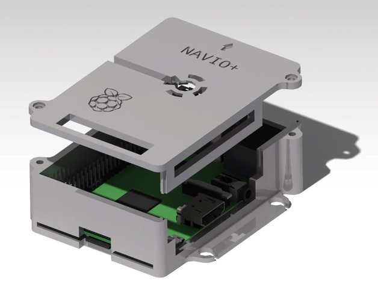

[NAVIO+ plus Raspberry Pi2 case by Mauricio Cancino](http://www.thingiverse.com/thing:868826)

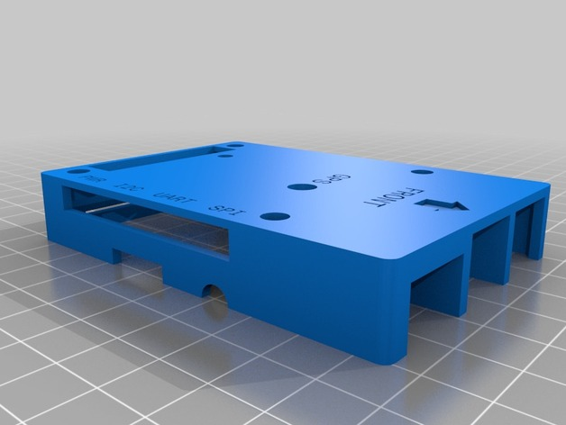
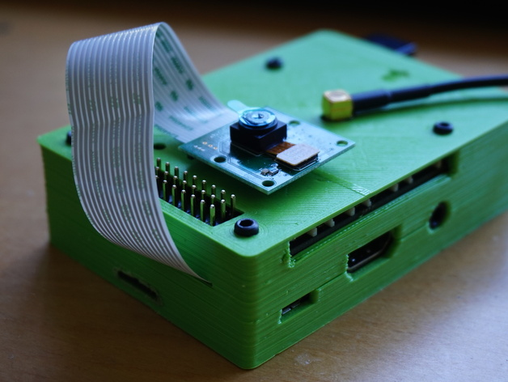

### Anti-vibration mount

We have designed an anti-vibration for Navio that can be easily 3D printed. It significantly simplifies mounting and eliminates vibrations. It is suitable both for Navio+ and Navio2.  
Bottom view:

Anti-vibration with Navio2 mounted on frame:

STL Files:  
[Top](https://github.com/emlid/hardware/blob/master/VibroNavio2top_rev_A.STL)  
[Bottom](https://github.com/emlid/hardware/blob/master/VibroNavio2bot_rev_A.STL)  

You will also need 8 blue vibration damping balls from [Hobbyking](http://www.hobbyking.com/hobbyking/store/__40603__Vibration_Damping_Ball_65g_Bag_of_8_.html)

###Available GPIO pins

GPIO pins not connected to anything on Navio+:

* 29 - GPIO5
* 31 - GPIO6
* 33 - GPIO13
* 35 - GPIO19
* 36 - GPIO16
* 32 - GPIO12 available on AUX connector, 5V logic level tolerant

###ADC pins

Under the Navio+ you can find pads ADC2 and ADC3, they can be used as either pin 4 or 5 in APM. ADC range is 0-3.3V .
