####RTK GPS

GPS RTK is technique that allows to determine centimeter-level coordinates using two GPS receivers - rover that is able to move and base station that stays static on the same position. Simple way to get acquainted with RTK is to use RTKLIB software that is able to perform GPS RTK processing on a computer using GUI or console version. In order to begin the following is required:

* Computer to run RTKLIB on
* GPS receiver capable of providing raw data such as U-blox NEO-6T dongle and connected to the computer.
* Proper GPS antenna. Patch or big helix will do, pcb or chip antennas won’t work.
* Access to the corrections from a base station in close range OR a second raw data GPS receiver and antenna to set up your own base station.

This tutorial shows how to set up your own base station using STRSVR program from RTKLIB software package on a PC and U-blox NEO-6T receiver.

For instructions how to set up a rover please follow to this [tutorial](rtklib-rover-setup.md).

####Prerequisites for good RTK performance

In order to achieve proper RTK performance the following conditions should satisfied:

Good antenna with stable phase center. Recommended models are:

* [Tallysman TW1421](http://www.tallysman.com/TW1421.php) - compact antenna without case, best for integrating
* [Tallysman TW4320](http://www.tallysman.com/TW432X.php) - compact antenna with case, would be great as a rover
* [Tallysman TW3400](http://www.tallysman.com/TW3400.php) - fixed mount, would fit great as a roof base station

Adding a big ground plane to the antenna can be a good idea - simply place it on a piece of metal >70cm.
Full skyview is necessary. Base station antenna should be located in a place with an open sky such as a roof.
Noise sources should be absent. Keep antenna away from other antennas.

####Install RTKLIB

RTKLIB software package is available for download from it’s official [website](http://www.rtklib.com/prog/rtklib_2.4.2_bin.zip). To install simply unpack the downloaded archive somewhere on your drive.

####Run STRSVR

Navigate to the RTKLIB directory, enter the \bin subdirectory and then run strsvr.exe.
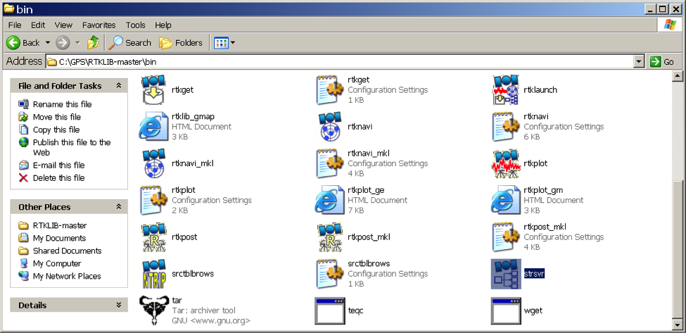


####Set up input stream

Specify where RTKLIB should be getting the raw data from. For U-blox NEO-6T dongle set Input as “Serial”.

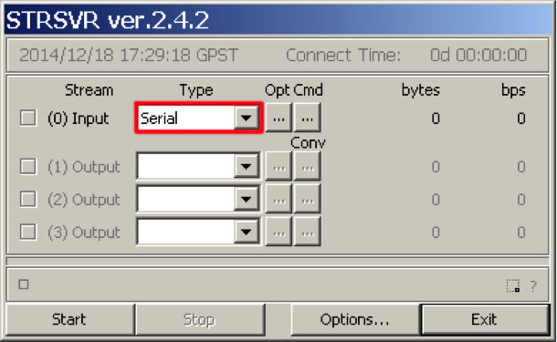

**Open serial options**

Click on the “Opt” button in the Rover row to open serial port options.

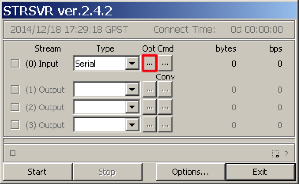


**Specify serial port options**

Pick the COM port of the U-blox receiver from the list. If you have no other devices connected, it probably would be the only available port in the list. Another option to figure out which port is it is to open the Device manager, find “U-blox AG receiver” and check the COM port assigned to it. If the U-blox receiver is connected directly over USB (without USB-to-UART adapter) the baud rate does not matter, otherwise the default one is 9600.
Click OK to get back to the Input Streams window.

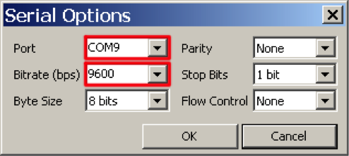

####Receiver configuration

Click on the “Cmd” button to open receiver configuration.
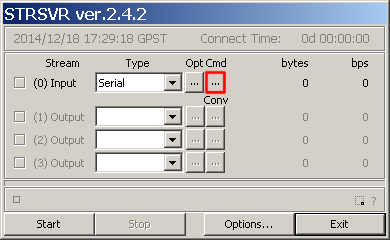


**Specify receiver configuration commands**

RTKLIB requires raw data messages in order to obtain the necessary information. The messages are: RXM-RAW - provides observations, RXM-SFRB - provides nav data such as ephemeris and other. Also, for moving rovers it’s better to set a higher rate.

Check “Commands at startup” and paste the following commands into the text box:
```
!UBX CFG-RATE 200 1 1
!UBX CFG-MSG 2 16 0 1 0 1 0 0
!UBX CFG-MSG 2 17 0 1 0 1 0 0
```


Click OK to get back to the Input Streams window.


####Set up output stream type
**Choose output stream type**

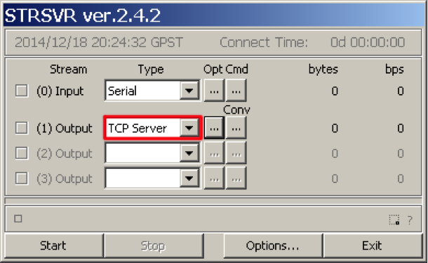

**Open output stream options**

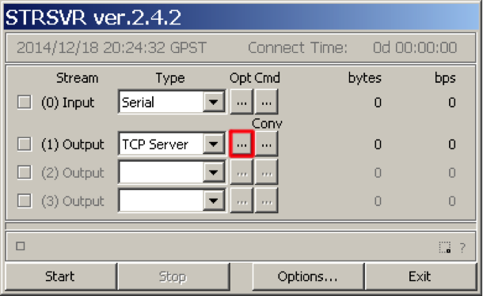

**Specify TCP server port**

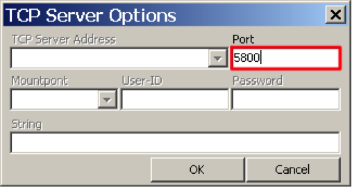

**Open data conversion options**


**Specify conversion options**

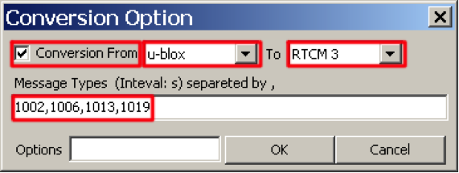

1002 GPS L1 observations, extended information
1006 ARP station coordinates, ECEF XYZ and extended information (antenna height)
1013 System parameters, list of transmitted message types and update rates
1019 GPS Ephemeris


####Set base station position


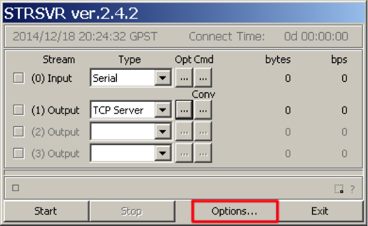

**Specify base station antenna position**

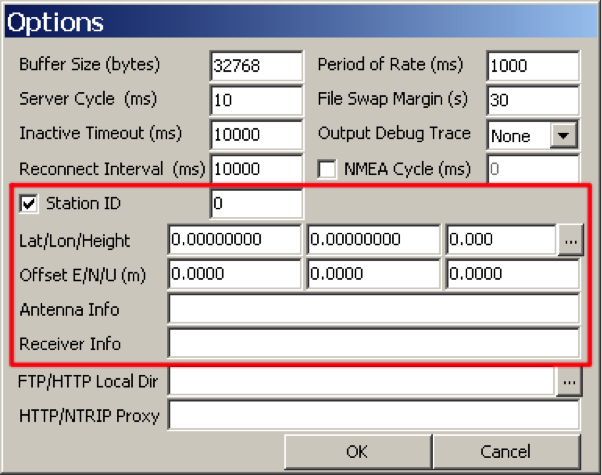

####Start STRSRV

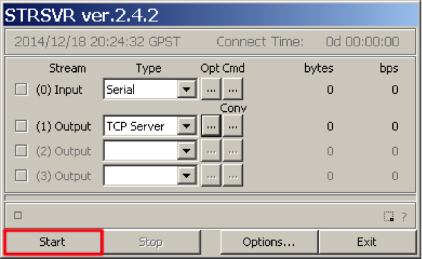
