This tutorial shows how to set up an RTK rover using RTKNAVI program from RTKLIB software package on a PC and U-blox NEO-6T receiver with corrections from an NTRIP base station. If you’d like to set up your own base station please follow this [tutorial](rtklib-base-setup.md).


####Install RTKLIB

RTKLIB software package is available for the download from it’s official website by the following [link](http://www.rtklib.com/prog/rtklib_2.4.2_bin.zip).

Simply unpack the downloaded archive somewhere on your drive.

####Run RTKNAVI

Navigate to the RTKLIB directory, enter the \bin subdirectory and then run rtknavi_mkl.exe.

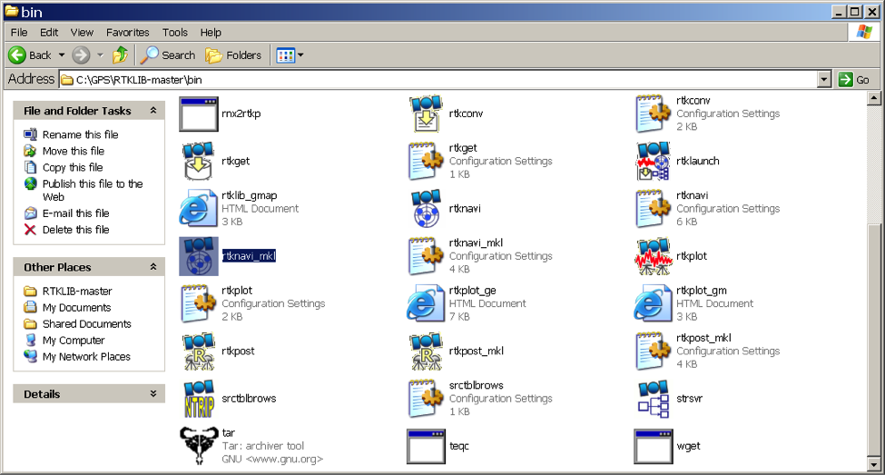

####Set up rover input stream

In the main RTKNAVI window click on the “I” button in the top right corner to open input options.

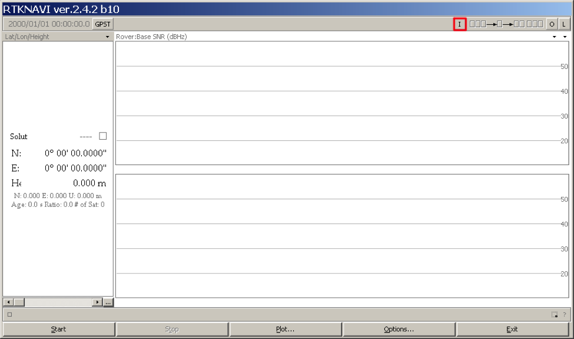

Specify where RTKLIB should be getting the rover data from. For U-blox NEO-6T dongle set:


* Check (1) Rover input stream
* Type = “Serial”
* Format = “u-blox”

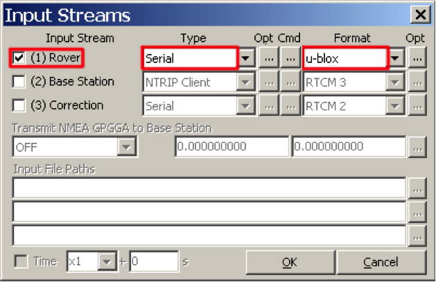

***Open serial options***

Click on the “Opt” button in the Rover row to open serial port options.

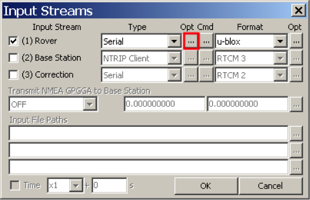 

***Specify serial port options***

Pick the COM port of the U-blox receiver from the list. If you have no other devices connected, it probably would be the only available port in the list. Another option to figure out which port is it is to open the Device manager, find “U-blox AG receiver” and check the COM port assigned to it. If the U-blox receiver is connected directly over USB (without USB-to-UART adapter) the baud rate does not matter, otherwise the default one is 9600.
Click OK to get back to the Input Streams window.


####Receiver configuration
***Open receiver configuration***

Click on the “Cmd” button in the Rover row to open receiver configuration.


***Specify receiver configuration commands***

RTKLIB requires raw data messages in order to obtain the necessary information. The messages are: RXM-RAW - provides observations, RXM-SFRB - provides nav data such as ephemeris and other. Also, for moving rovers it’s better to set a higher rate.

Check “Commands at startup” and paste the following commands into the text box:

```bash

!UBX CFG-RATE 200 1 1
!UBX CFG-MSG 2 16 0 1 0 1 0 0
!UBX CFG-MSG 2 17 0 1 0 1 0 0

```

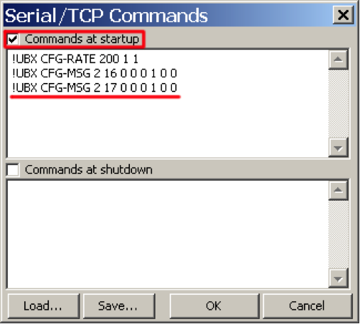

Click OK to get back to the Input Streams window.


####Set up base input stream

Depending on the access to the base station that you have, base input stream configuration may differ:

***Serial port on the same machine***

If you’d like to use another U-blox dongle connected to the same machine (rover would be limited by the cable length, but such configuration can be used for testing), set it up the same way as the rover input stream.

***TCP***


***NTRIP***

If you have an access to the base station from some reference network set up the NTRIP client connection as described below.

To set up an NTRIP base input stream:


* Check “(2) Base Station”
* Type = “NTRIP Client”
* Format = “RTCM 2” or “RTCM 3” depending on the NTRIP caster.

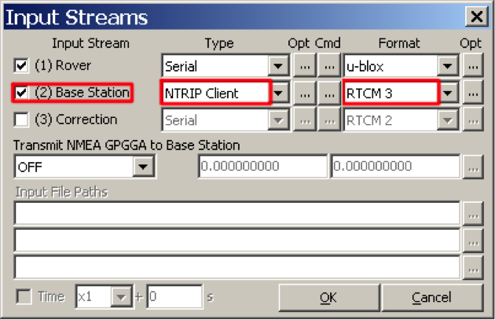

Click on the “Opt” button in the Base Station row to open serial port options.


Specify your personalized NTRIP options provided by your NTRIP caster. Our options provided only as an example. Then get back to the main RTKNAVI window.

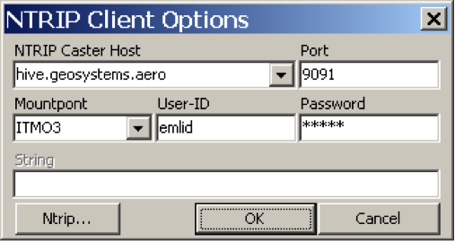

####Set up RTK mode

In the main RTKNAVI window click on the “Options” button open processing options.

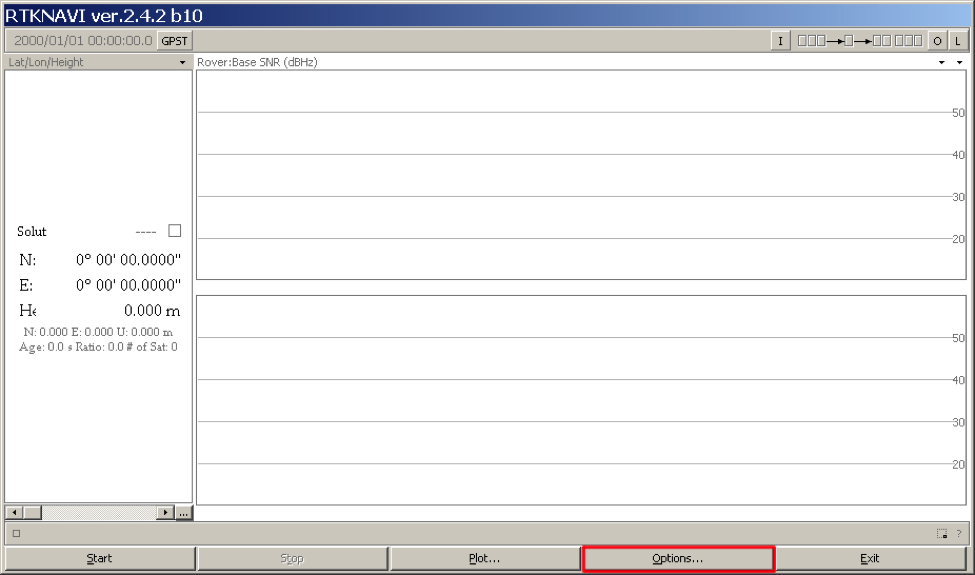

***Specify processing options***

On the “Setting1” tab specify the following options:
* Positioning mode = “Static” for static rover or “Kinematic” for moving rover
* Frequencies = “L1”
* Elevation mask = “15”
* Satellite ephemeris = “Broadcast”
* Check “GPS”

Leave all other options in their default state (as on the following screenshot).

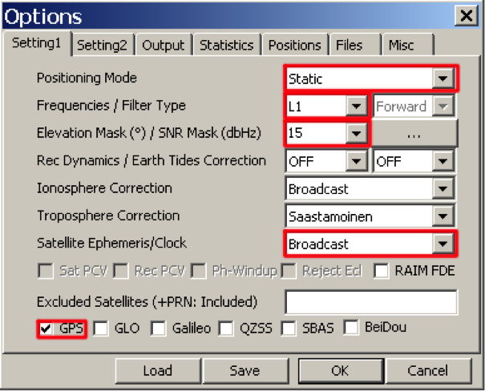

####Specify base antenna position

On the “Positions” tab specify the Base Station antenna position. If you’re using NTRIP base stream, the antenna position is probably available in the stream, so you can pick “RTCM Antenna Position”. If not, you can specify the position manually. If you do not know the antenna position pick “Average”.


####Start RTK processing

Get back to the main RTKNAVI window and press the “Start” button.

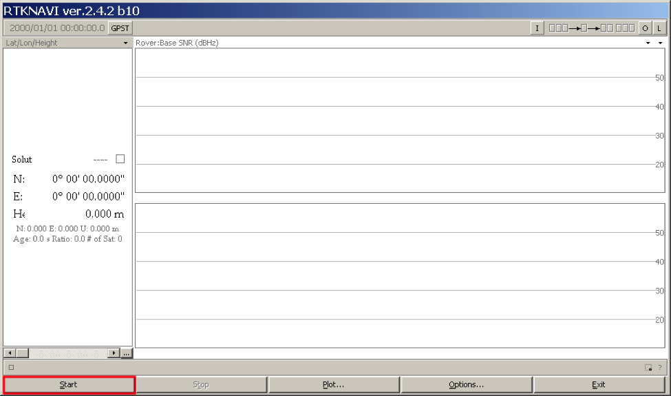

If rover and base input streams were set up correctly there would be no error messages and you should see satellite visibility in a couple of seconds.

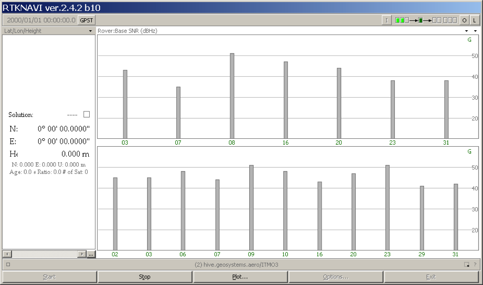

In few more seconds the solution status should change to “FLOAT”, which means that RTK engine is working and that both rover and base input stream data is available.

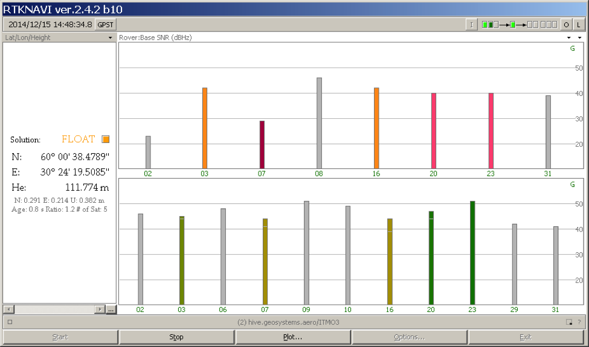

If the environment conditions are satisfactory for RTK, in 5-15 minutes the solution status should change to “FIX”.

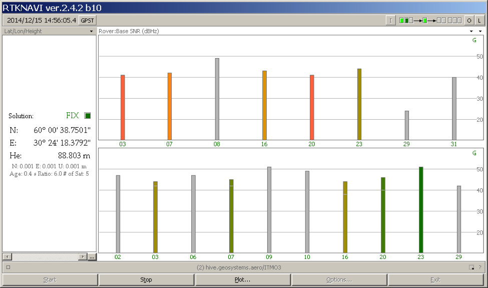

To see the calculated coordinates on a map click the “Plot” button, the RTKPLOT window should pop up. You can load map images or export coordinates into Google Earth.

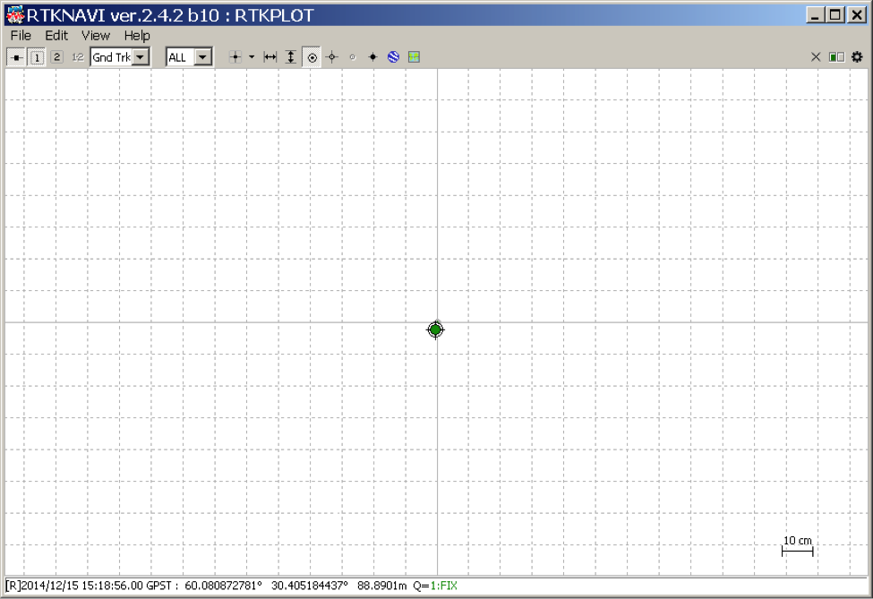


####References

Another RTKNAVI tutorial is available by this [link](http://www.rtklib.com/rtklib_tutorial.htm).

For more information about RTKLIB please refer to the RTKLIB [manual](http://www.rtklib.com/prog/manual_2.4.2.pdf).
