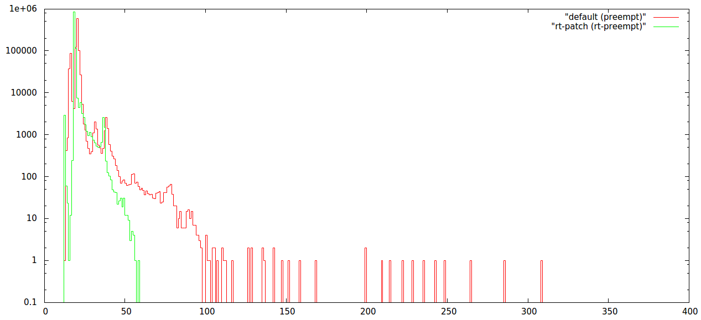

#####PREEMPT_RT



This is a release of Raspbian with real-time kernel. It is compatible with Raspberry Pi models: 2B, B+, A+, B, A.
It is based on 2015-02-16-raspbian-wheezy with default kernel replaced to 3.18.9-rt5-v7+ kernel and a few additional tunings.

Default Raspbian kernel 3.18 is configured with PREEMPT option and provides worst case latency around hundreds of microseconds. Real-time demanding applications require lower latencies than that. Real-time patch lowers the worst case latency to tens of microseconds, improving performance of real-time applications such as autopilots to be run on Linux.

Results of testing with

```
sudo cyclictest -l1000000 -m -n -a0 -t1 -p99 -i400 -h400 -q
```

```
PREEMPT    #Min: 00013uS #Avg: 00021uS #Max: 0307uS
PREEMPT_RT #Min: 00011uS #Avg: 00018uS #Max: 0058uS
```

Histogram values are on the plot above.

####List of changes

List of changes includes:

* Replaced default kernel with PREEMPT_RT kernel 3.18.9-rt5-v7+
* Enabled non-FIQ USB driver (currently FIQ driver is not compatible with RT-patch on RPi2)
* Enabled camera, SPI, I2C and set its speed to 1MHz (if you’d like to connect a sensor with lower clock speed, add dtparam=i2c_baudrate=400000 option in /boot/config.txt)
* Installed pigpio, screen, socat, python-smbus, python-spidev, cmake, cyclictest
* Disabled serial console, so /dev/ttyAMA0 UART can be used for radio (to enable back use raspi-config or edit /boot/cmdline.txt), disabled extra ttys
* Default WiFi network: ssid “emlidltd”, psk “emlidltd”, key_mgmt=WPA-PSK

**Source code**

* Patched and configured source code for Raspberry Pi real-time kernel is available on [GitHub](https://github.com/emlid/linux-rt-rpi)

**Issues**

* **IMPORTANT: Do NOT overclock Raspberry Pi 2 as SPI driver doesn't calculate clock frequency correctly when core is overclocked. This should be fixed in the future.**

####SD card image download

* [emlid-raspberrypi2-raspbian-rt-20150401.img](https://files.emlid.com/images/emlid-raspberrypi2-raspbian-rt-20150401.img)

To flash the SD card refer to this [tutorial](http://elinux.org/RPi_Easy_SD_Card_Setup#Flashing_the_SD_Card_using_Windows)
