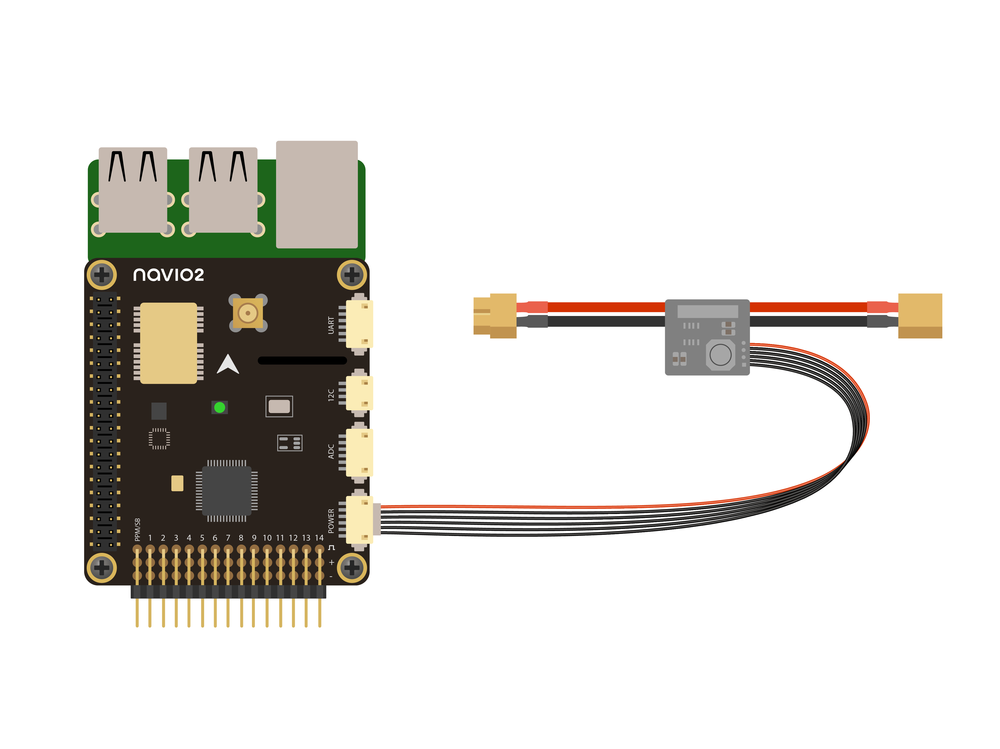

### Auxiliary function switches

Auxiliary function switches on channels 5-8 are still not supported and could lead to erroneous PWM generation on motors' channels.

!!! danger ""
    We do ask to NOT SET AUXILIARY FUNCTION SWITCHES TO RC5..8!

### Relay Switch

A “Relay” is an digital output pin that can be switched between 0 volts and 3.3V. Similar to a servo it allows the flight controller to invoke some action from another device on the vehicle.

!!! note ""
    This feature available only on ArduCopter.

[Relay Switch setup](http://ardupilot.org/copter/docs/common-relay.html)

You need to specify **RELAY_PIN** parameter in `Full Parameter List` in Mission Planner or in `Parameters` in QGC. Use the following table for this:

| Name | Digital Pin number |
| ------- | :-------: |
| PWM1 | 0 |
| PWM2 | 1 |
| PWM3 | 2 |
| PWM4 | 3 |
| PWM5 | 4 |
| PWM6 | 5 |
| PWM7 | 6 |
| PWM8 | 7 |
| PWM9 | 8 |
| PWM10 | 9 |
| PWM11 | 10 |
| PWM12 | 11 |
| PWM13 | 12 |
| PWM14 | 13 |
| IO17 | 14 |
| IO18 | 15 |
| LED RED | 16 |
| LED GREEN | 17 |
| LED BLUE | 18 |

!!! danger ""
    Don't set digital pin to PWM channel used for control servos!


### Second compass configuration

Navio2 contains two compasses - AK8963 and LSM9DS1. The latter has lower offsets and set as primary.
AK8963 is disabled by default.  

We're walking you through the steps requeired to perform the onboard compass calibration. 

## Onboard calibraton

Navigate to Initial Setup - Mandatory Hardwawre - Compass

- If you use two compasses tick **Use this compass** in **Compass #2** tab
- Click on **Start** button in **Onboard Mag Calibration** tab
- Rotate your drone around all axis
- Wait for calibration to complete (the process ends with a message similar to one on the picture attached below)


- Click **Accept** button (there's a change nothing's going to happen in responce)
- Swith to another view and get back to **Compass Calibration**
- Verify that offsets that have been calculated in the previous steps have been saved

### Voltage and current sensing

If you have original power module connected to Navio2, you can get battery voltage and curent readings from it.



To setup voltage and current measurement for ArduPilot:

- switch to Initial Setup tab in Mission Planner
- navigate to Optional Hardware - Battery Monitor section
- set Monitor, Sensor and ArduPilot Ver options as shown below


Now you need restart both ArduPilot and connection between Mission Planner and ArduPilot:

- use Ctrl-F shortcut to open Temp Screen
- press 'reboot pixhawk' button
- on main menu bar press 'DISCONNECT' and then 'CONNECT'

When everything is done you should see voltage and current values on Flight Data screen. 

Also you can check in full parameter list that:

```bash
BATT_CURR_PIN 3
BATT_VOLT_PIN 2
```
### Further configuration

As other ArduPilot configuration procedures are very similar for most ArduPilot-running autopilot hardware, please use the ArduPilot documentation.

[Hardware configuration](http://ardupilot.org/copter/docs/configuring-hardware.html)

[ESC Calibration](http://ardupilot.org/copter/docs/esc-calibration.html)

[Enable RC Failsafe](http://ardupilot.org/copter/docs/radio-failsafe.html)!
