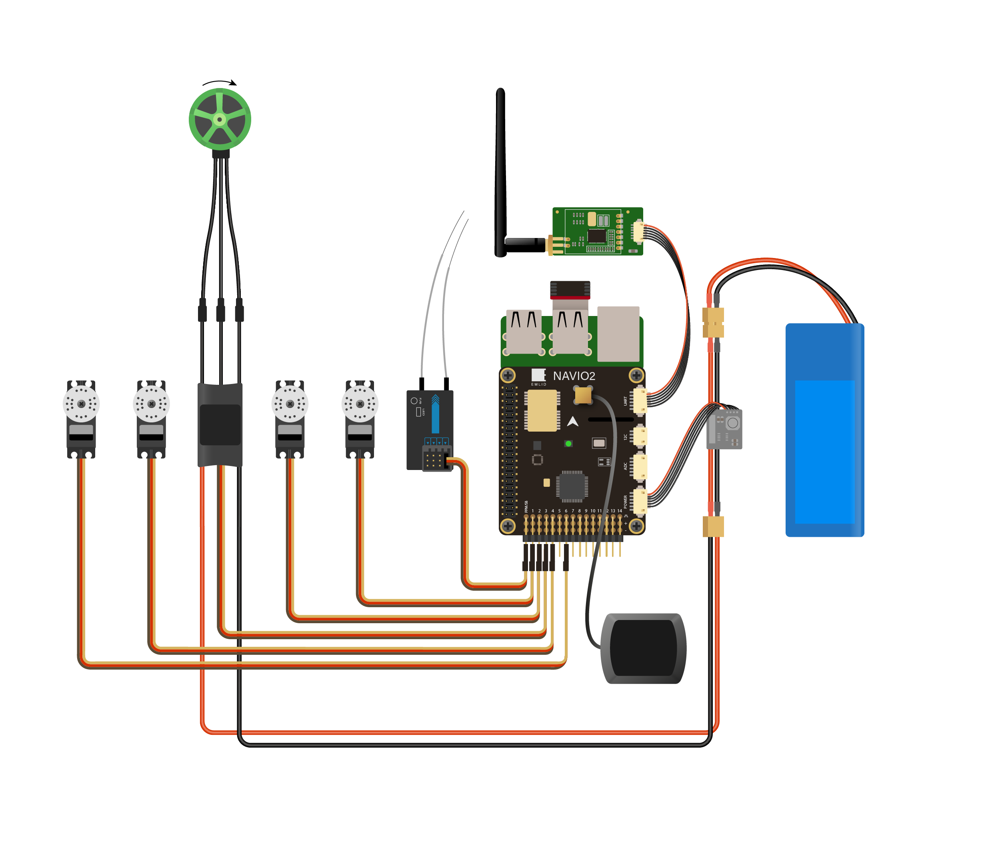
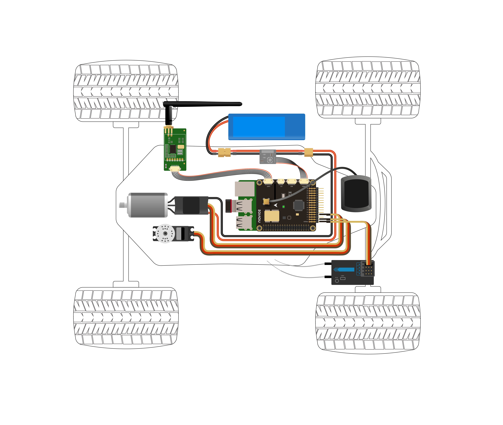
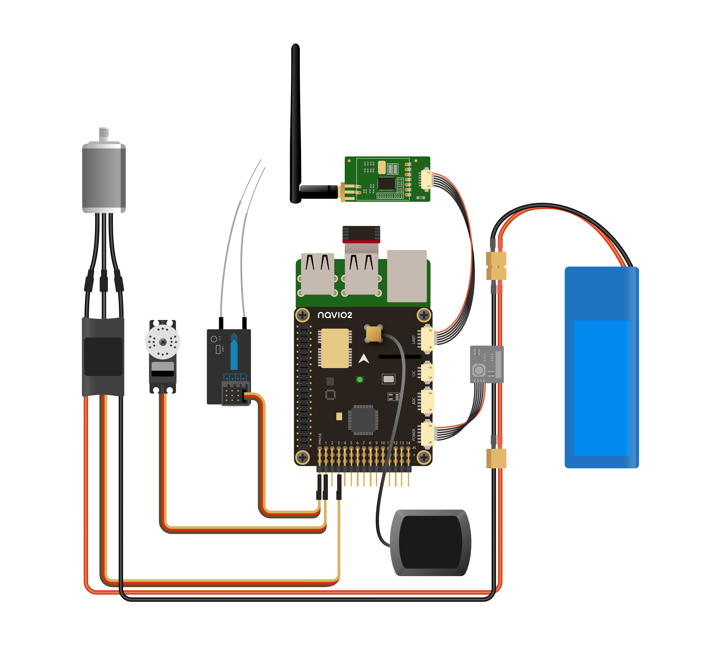

## Overview

Please take a look at ArduPilot
[documentation](http://ardupilot.org/copter/docs/connect-escs-and-motors.html#motor-order-diagrams)
to get a deeper understanding what's going on inside. This is essential for every build.
We present a couple of typical setup schemes below. Either way, you're encouraged to read through ArduPilot docs before proceeding further.

## Quadcopter setup

## Plane setup

## Rover setup

