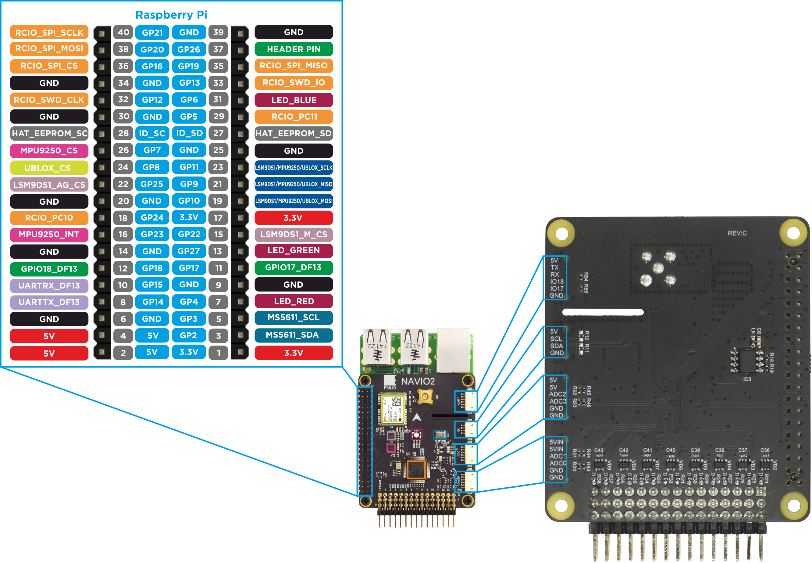

### Pinout

40-pin header pinout and sensors connections are displayed on the following picture:

IO17 and IO18 pins on UART are available. 
GP26 (pin 37) on Raspberry Pi is also free. It may be used with lengthened extension header.
