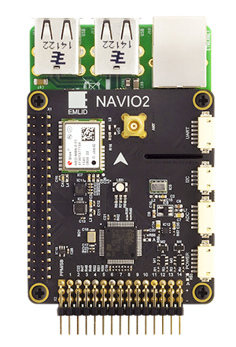

 

This is a documentation for Navio2 - autopilot HAT for Raspberry Pi.

Documentation for Navio+ can be found [here](https://docs.emlid.com/navio/).

### Collaboration

This document can be edited on [GitHub](https://github.com/emlid/navio2-docs) in markdown. If you find any mistakes, typos or  pieces that are not documented well enough simply open an issue or contribute by sending a pull request.

### Discussion

We are happy to answer any questions at [community.emlid.com](http://community.emlid.com)
