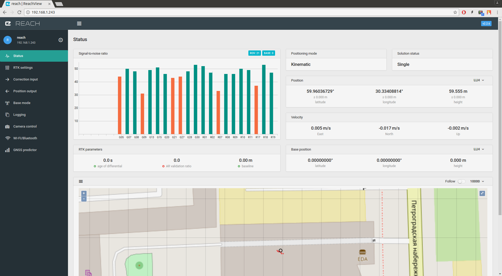

## About 

ReachView is a web-based app that allows you to take full control of Reach RTK module and Reach RS. It is the most user friendly app ever created for an RTK system and apart from numerous features has OTA updates that ensure that you constantly work with up-to-date version of the app. It works on any device with a browser and does not require internet connection. ReachView is hosted on the Reach itself and is accessed via Wi-Fi connection, which makes it compatible with Windows, OSX, Linux, Android and iOS.

## Resolving IP

ReachView app is served via a browser. In order to access the app one needs to find the IP address of the Reach in the network. Depending on the operating system this might be done in different ways. Similar as it happens on the Web a local IP address can be associated with a name, unfortunately not every OS supports it.

### When Reach is connected to a Wi-Fi access point/router

Your device must be connected to the same Wi-Fi network as Reach. Reach will show up as "Murata Manufacturing" device.

#### Windows
Access ReachView by typing “http://reach.local” in your browser. If you have changed name of the device, please type “http://device_name.local”. If the name could not be resolved:

- Install Apple Bonjour (it is likely already installed on your system if you have iTunes or Skype).
- Find the IP address using ["Zenmap"](https://nmap.org/zenmap/).

#### OSX/Linux
Access ReachView by typing “http://reach.local” in your browser. If you have changed name of the device, please type “http://device_name.local”. If the name could not be resolved:

- Find the IP address using [“nmap”](https://nmap.org/).

#### iOS
Access ReachView by typing “http://reach.local” in your browser. If you have changed name of the device, please type “http://device_name.local”.  If the name could not be resolved:

- Find the IP address using “Fing” app.

#### Android  
Android does not support name resolution in local network. You will need to find the IP address:

- Find the IP address using “Fing” app.
- Use “Network Tools” app, it is also able to find Reach IP address when it is connected to your smartphone hotspot.

### When your device is connected to Reach Hotspot

By default Reach creates a Wi-Fi hotspot and you can connect to it as to any other Wi-Fi network. Beware that sometimes your mobile phone will attempt to automatically switch to 3G/4G connections as Wi-Fi hotspot created by Reach does not provide internet access.

+ When prompted if you want to stay connected to the network without Internet connection answer “yes”.
+ If your smartphone is still on 3G/4G connection and there is “?” mark near the Wi-Fi icon you might want to temporary disable mobile data. That will force your smartphone to connect to the Wi-Fi network.

**Access ReachView by typing “http://reach.local” or 192.168.42.1 in your browser on any OS.**

## First setup

### Connecting to Reach

When Reach is powered for the first time it will create a Wi-Fi hotspot.

+ Open a list of Wi-Fi networks on your smartphone, tablet or laptop.
+ Connect to a network named reach:xx:xx (ex. reach:66:ac).
+ Type network password: emlidreach.

### Setting up Wi-Fi

After connecting to the network hosted by reach, open a web browser on your smartphone, tablet or laptop. 

Type http://192.168.42.1 in the address bar and you will see ReachView Updater.

Press plus button and enter your Wi-Fi network name, security type and password. Press Save button. That will make Reach remember your Wi-Fi network.

Press on your added network and click Connect.

Reach device will now attempt to connect to your Wi-Fi network. You should connect your device to that network too.

If Reach did not connect to Wi-Fi network it will automatically switch to hotspot mode. Try again from the beginning of this chapter. Check that your network name and password are correct.

### Updating

If connection to Wi-Fi was successful you can [now find Reach on your network](#resolving-ip) and open ReachView. During first setup you will see the ReachView Updater. It is a separate app that handles self-testing, time synchronization and updates of the main ReachView app.

ReachView updater will check for software updates and will install them.

Press Reboot and go to the app! button. Wait while device reboots.

In about a minute refresh the page with ReachView app.

