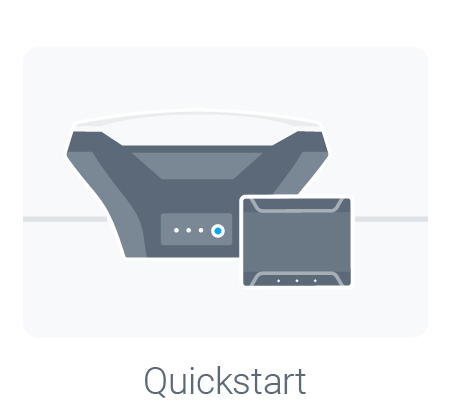
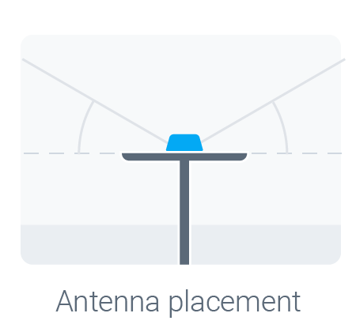
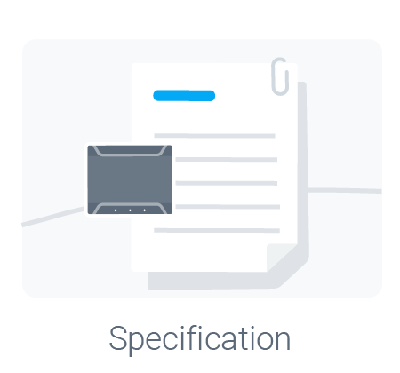

Welcome to your Emlid Reach M+!

  [{: style="width: 200px;"}](quickstart.md)
  [{: style="width: 200px;"}](tutorials.md)
  [{: style="width: 200px;"}](common/reachview)

  [{: style="width: 200px;"}](antenna-placement.md)
  [{: style="width: 200px;"}](power-supply.md)
  [{: style="width: 200px;"}](specs.md)

## Package contents

In the box:

* 1 x Reach M+ module

* 1 x USB cable 

* 1 x USB-OTG cable

* 1 x JST-GH 6-pin to jumper pin cable 

* 1 x JST-GH 5-pin to jumper pin cable

Optionally: 

* 1 x Tallysman multi-GNSS antenna 

### Collaboration

This document can be edited on GitHub in markdown. If you find any mistakes, typos or  pieces that are not documented well enough simply open an issue or contribute by sending a pull request.

### Discussion

We are happy to answer any questions at [community.emlid.com](http://community.emlid.com)
