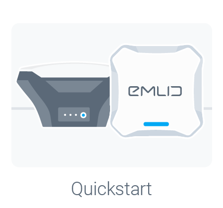
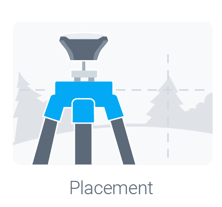
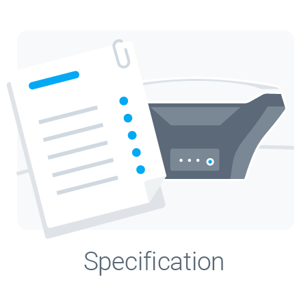

Welcome to your Emlid Reach RS / Reach RS+!

  [{: style="width: 200px;"} ](quickstart.md)
  [{: style="width: 200px;"}](../common/tutorials/intro)
  [{: style="width: 200px;"}](../common/reachview)

  [{: style="width: 200px;"} ](placement.md)
  [{: style="width: 200px;"}](power-supply.md)
  [{: style="width: 200px;"}](specs.md)

### Package contents

In the box:

* 1 x Reach receiver

* 1 x Carry case

* 1 x Radio antenna

* 1 x Adapter for survey pole ( 5/8'')

* 1 x USB cable

### Collaboration

This document can be edited on GitHub in markdown. If you find any mistakes, typos or  pieces that are not documented well enough simply open an issue or contribute by sending a pull request.

### Discussion

We are happy to answer any questions at [community.emlid.com](http://community.emlid.com)
