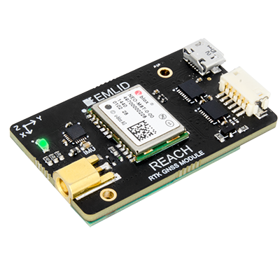

!!! tip ""
	Reach has been replaced with [Reach M+](https://emlid.com/reach). Documentation for Reach M+ can be found [here](https://docs.emlid.com/reachm-plus/).

 

### Reach RTK kit

Reach RTK kit includes the following:

* 2x Reach RTK module

* 2x Tallysman TW4721 antenna with adhesive mount

* 2x DF13 <-> DF13 straight cable

* 2x DF13 <-> jumper wires cable

* 2x Micro-USB <-> USB cable

* 2x Micro-USB <-> USB-F OTG cable

### Standalone Reach unit

Standalone Reach units come with the following:

* Reach RTK module

* DF13 <-> DF13 straight cable

* DF13 <-> jumper wires cable

* Micro-USB <-> USB cable

* Micro-USB <-> USB-F OTG cable

### Collaboration

This document can be edited on GitHub in markdown. If you find any mistakes, typos or  pieces that are not documented well enough simply open an issue or contribute by sending a pull request.

### Discussion

We are happy to answer any questions at [community.emlid.com](http://community.emlid.com)
